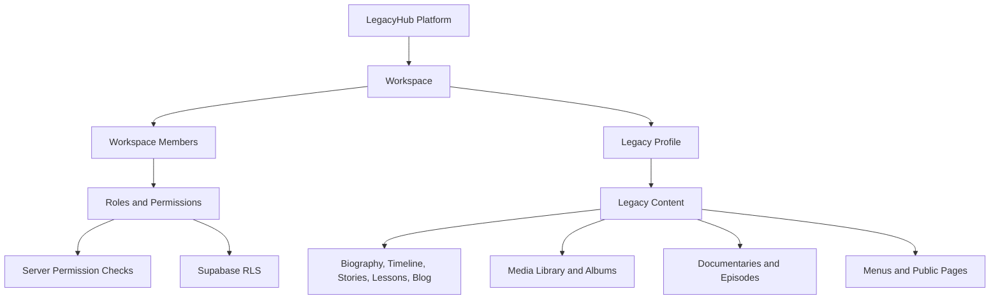

# LegacyHub Architecture

LegacyHub is the reusable platform architecture behind the Baba Muyi Legacy public archive. The current codebase is a Next.js App Router project with Supabase foundations, local JSON fallback data, and a workspace/legacy-profile model.

## Architecture Summary

## Current Next.js Architecture

- App Router routes live in `app/`.
- Public CMS-driven pages use `components/cms/cms-public-page.tsx` and local data from `lib/cms-store.ts`.
- Public layout/navigation lives in `app/layout.tsx`, `components/public-navigation.tsx`, and `components/mobile-navigation.tsx`.
- Admin routes live in `app/admin/*`.
- Admin navigation and workspace context live in `components/admin-navigation.tsx` and `components/admin/workspace-context-bar.tsx`.
- Server actions for CMS and admin workflows live in `lib/cms-actions.ts`, `lib/admin-actions.ts`, and `lib/auth-actions.ts`.

## Supabase Architecture

- Browser/server/admin clients: `lib/supabase/browser.ts`, `lib/supabase/server.ts`, `lib/supabase/admin.ts`.
- SSR middleware helper: `lib/supabase/middleware.ts` and `middleware.ts`.
- Environment validation: `lib/env.ts`.
- Migrations:
  - `supabase/migrations/0001_initial_foundation.sql`
  - `supabase/migrations/0002_cms_access_media_documentary_menu.sql`
  - `supabase/migrations/0003_workspace_saas_foundation.sql`
- Hand-maintained types: `lib/database.types.ts`.
- Remote generated types: not yet implemented.

## Hostinger Deployment

Hostinger must build from a repository root that contains `package.json`, `app/`, `components/`, `lib/`, `supabase/`, `next.config.ts`, and `tsconfig.json`. Current deployment risk: GitHub `origin/main` has only `PROJECT_AUDIT.md` and `package.json` until the complete local commit is pushed.

Relevant docs:

- `DEPLOYMENT_HOSTINGER.md`
- `README.md`
- `PROJECT_AUDIT.md`

## GitHub Workflow

The intended workflow is:

1. Work locally from `/Users/optiscale/Documents/web/baba-muyi-legacy`.
2. Run lint, typecheck, and build from the repository root.
3. Commit changes on a focused branch or stable `main` only when ready.
4. Push to `origin/main` or open a pull request depending on milestone risk.
5. Deploy from Hostinger after `origin/main` contains the complete app.

Current blocker: local Git push requires GitHub authentication.

## Multi-Tenant Workspace Model

Workspace tables were added in `supabase/migrations/0003_workspace_saas_foundation.sql`:

- `workspaces`
- `workspace_roles`
- `workspace_members`
- `workspace_invitations`
- `legacy_profile_members`

The Baba Muyi Family Archive is the first workspace. It should be treated as seeded customer data, not as a permanent platform singleton.

## Legacy Profile Model

`legacy_profiles` represents the person, family, organisation, or institution being preserved. Baba Muyi is the first legacy profile. Content tables should be scoped by both `workspace_id` and `legacy_profile_id` where relevant.

## Authentication

- Login page: `app/login/page.tsx`.
- Reset/update routes: `app/forgot-password/page.tsx`, `app/reset-password/page.tsx`, `app/update-password/page.tsx`.
- Callback: `app/auth/callback/route.ts`.
- Auth actions: `lib/auth-actions.ts`.
- Admin guard: `lib/auth.ts`.

When Supabase is missing, `lib/auth.ts` provides a local owner fallback for development. This is not production authentication.

## Authorisation

- Role definitions: `lib/permissions.ts`.
- Tenant context: `lib/tenant-context.ts`.
- Server actions call `requireLegacyProfilePermission` or related helpers.
- Current limitation: permissions are role-mapped in code and partially reflected in SQL, but remote enforcement is not yet tested.

## Row Level Security

RLS is defined across migrations for users, workspaces, legacy profiles, content, media, menus, settings, audit logs, and storage objects. It must be tested remotely before launch. Do not consider RLS complete until cross-workspace and cross-profile access tests pass against a real Supabase project.

## Storage Architecture

Storage buckets are defined in `supabase/migrations/0001_initial_foundation.sql`:

- `legacy-images`
- `profile-images`
- `legacy-documents`
- `legacy-audio`
- `legacy-video-clips`
- `tribute-uploads`

Helpers in `lib/media/storage.ts` create safe filenames, storage paths, signed read URLs, and deletion calls. Actual upload workflow remains partial.

## Public And Private Delivery

- Public content is rendered through Next.js and CMS data.
- Public published records should be readable without authentication.
- Private records must require workspace/profile membership or access grants.
- Private media should use signed URLs.

## Menu System

Menu schema exists in `supabase/migrations/0002_cms_access_media_documentary_menu.sql`. Local menus are currently read from `data/cms.json` through `lib/cms-store.ts`, `components/public-navigation.tsx`, and `components/mobile-navigation.tsx`.

## Content Publishing And Moderation

Current code supports draft, scheduled, published, and archived statuses in local CMS actions. Product requirements add an in-review state and stronger moderation queues. Contributions should remain private until reviewed.

## Audit Logging

`audit_logs` exists in migrations. Full server-side audit writes are not yet complete.

## Local Development Fallback

When Supabase environment variables are absent, the app reads and writes `data/cms.json`. This fallback is workspace-aware and useful for local development, but it does not prove production database behavior, RLS, storage access, auth, invitations, or cross-tenant isolation.

## Future Architecture Areas

- Subscriptions and plan limits.
- Custom domains per workspace/profile.
- AI transcription, tagging, and content assistance.
- Bulk import/export.
- Enterprise SSO and advanced audit controls.
